## Traffic Sign Recognition Program
[](http://www.udacity.com/drive)

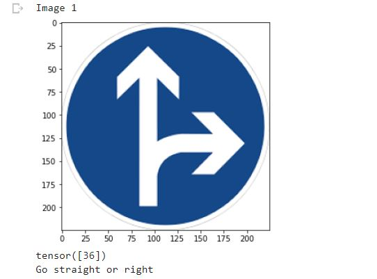

<p> The project focuses on developing a classfier to classify the traffic sign boards. We use the dataset from German traffic signs to train the classifier. The classifier uses the
Lenet Architecuture to perform the classification task. The accuracy of the train set is 99.93%, for evaluation set it is 93.33%. The model has an accuracy of 92.20% for the images 
in the test which was not known to the model while training. </p>

<h2> Dataset </h2>

<p> We use the dataset from the German traffic sign. The dataset is available in http://www.benchmark.ini.rub.de/?section=gtsrb&subsection=dataset . The dataset has been splitted 
into train,test and eval sets. The train set contains 34799 images, eval contains 4410 images and finally the test set contain 12630 images. Thw images are of size 32x32x3 dimensions
which are colored images. The dataset has 43 classes signifying each sign in the German signs. The dataset has high volumes of major signs and rare sign are of lesser in volume. The 
histogram of the dataset is shown below </p>

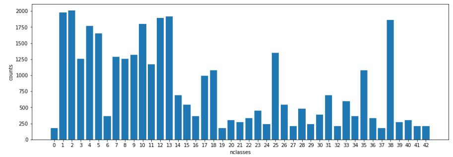

<h2> Model Architecture </h2>


<p> The Lenet model first takes the Nx32x32x3 images where N is the bacth size, passes it to the convolution layer of output channels being 6 and of kernel size 5x5.
This reduces the image dimension to Nx28x28x6. Now we pass the output of convolution layer to a tanh activation function. The image dimension is further reduced by average 
pooling of kernel size 2x2 with a stride of 2. This reduces the width and height dimension of image to half. Now the image size becomes Nx14x14x6. This is passed to another
convolution layer of output channels 16 and a kernel size of 5x5. This reduces the image dimensions to Nx10x10x16 which is being passed to tanh activation function and average 
pooled to make the dimensions of the image as Nx5x5x16. </p>

<p> Now this image of dimension Nx5x5x16 is passed to fully connected dense layers. The image is being flattened to get 400 neurons. This is connected to 120 neurons in the first
FC dense layer which has activation function of tanh. This is further passed to the second FC dense layer of size 84 neurons and tanh activation. Finally we introduce a classification
layer of 43 classes which is sent to softmax layer for classification.</p>

```
LeNet(
  (cnn_model): Sequential(
    (0): Conv2d(3, 6, kernel_size=(5, 5), stride=(1, 1))
    (1): Tanh()
    (2): AvgPool2d(kernel_size=2, stride=2, padding=0)
    (3): Conv2d(6, 16, kernel_size=(5, 5), stride=(1, 1))
    (4): Tanh()
    (5): AvgPool2d(kernel_size=2, stride=2, padding=0)
  )
  (fc_model): Sequential(
    (0): Linear(in_features=400, out_features=120, bias=True)
    (1): Tanh()
    (2): Linear(in_features=120, out_features=84, bias=True)
    (3): Tanh()
    (4): Linear(in_features=84, out_features=43, bias=True)
  )
)

```
<h2> Training </h2>

<p> The model is being trained for 15 epochs with a batch size of 64. The loss function being used in cross entropy loss function. The optimizer is Adam optimizer.
The loss curve is shown below and it reaches nearer to zero at the end of 15 epochs. The final model's weights are being saved in model.pth file for running in test set </p>

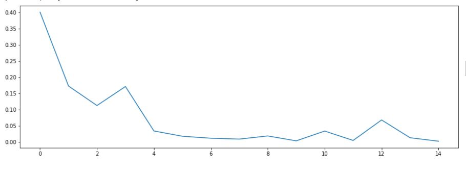

<h2> Testing </h2>

<p> The weights of the model are being loaded from the saved state dictionary and the model is set to eval mode so as to not disturb the weights which are being trained.
The test set accuracy is of 92.20%. Few Images of test set and prediction are shown below.</p>

<h3> Test 1 </h3>

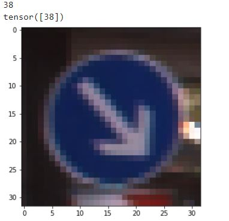

<p> The model predicted correctly as class number 38 which is Keep right.</p>

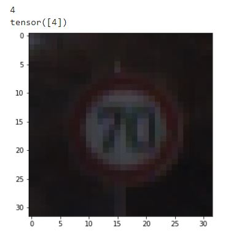

<p> The model predicted correctly as class number 4 which is Speed limit (70km/h).</p>

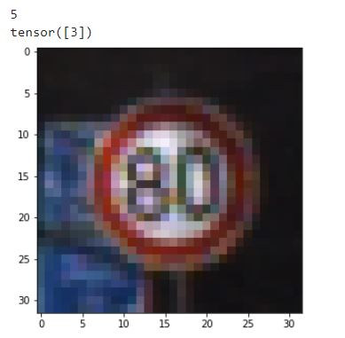

<p> The model misses slightly and predicts as class number 3 which is Speed limit (60km/h) but original value is Speed limit (80km/h) class 5. The other test results are names
as test4 and test5 images.</p>

<h2> Prediction on Random Traffic sign Web Images </h2>

<p> The model is further tested to predict on random images from web and the correspoding prediction and first five higer properties are shown below. </p>


```
First 5 probabilities:
tensor([9.2228, 9.0856, 8.2722, 7.3644, 6.1133], grad_fn=<SliceBackward>)
tensor([36, 32, 18, 12,  8])

```

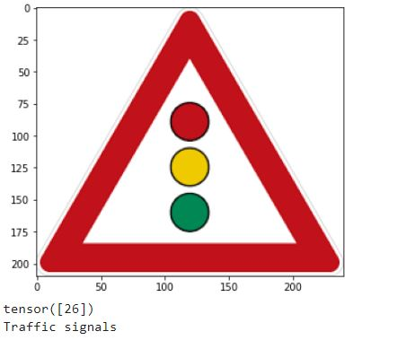

```
First 5 probabilities:
tensor([15.7573,  8.9293,  5.9251,  5.7350,  5.6857], grad_fn=<SliceBackward>)
tensor([26, 18, 12, 11, 37])

```

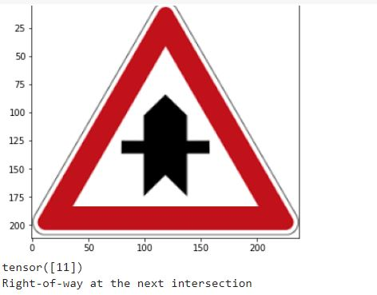

```
First 5 probabilities:
tensor([14.9549,  8.9363,  6.3633,  5.1891,  4.1887], grad_fn=<SliceBackward>)
tensor([11, 27, 26, 30, 28])

```

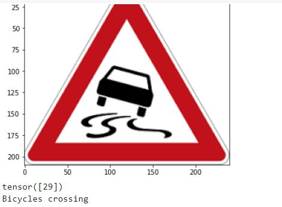

```
First 5 probabilities:
tensor([9.4062, 9.3045, 9.1612, 7.8754, 5.6117], grad_fn=<SliceBackward>)
tensor([29, 28, 30, 23, 34])

```

<p> The images from the web which are of higher dimensions are resize to 32x32 and then fed to the model. The model predicts properly for images 1 and 2. For 3 it misses priority road for intersection sign. For image four it misses the first higher probability. But for 3 best probability it chooses Beware of ice/snow. The other images and probabilities are in the notebook.</p>

<h2> Confusion matrix </h2> 

<p> The confusion matrix is plotted for the test dataset. The matrix is plotted with X axis being Predicted label and Y axis being True Label. The confusion matrix shows that 
 majority of prediction is in the diagonal which is good for our model as the model predicts most of the signs correctly. There are also some off diagonal numbers which indicate 
 wrong prediction but the diagonal numbers leads. </p>
 
 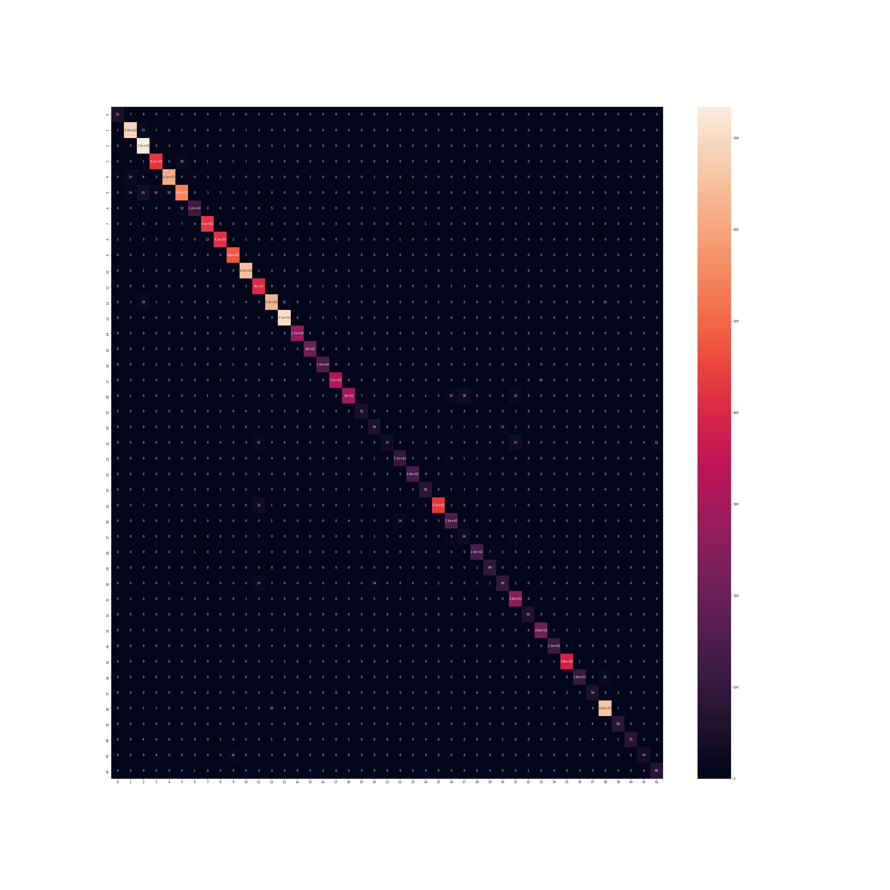
 
 
<h2> Filters Visualization </h2> 
<p> The weights in each of the filter after training are visualized. The function 'plot_filters_single_channel_big' takes in a weight tensor from the convoution layer and displays the complete collated images. It takes torch.Size([6, 3, 5, 5]) convolution layer and produces a visualization of dimension (15, 30). The image shows the filters which have high and low values. The filter with high values take the feature in the corresponding location in the image. The filters which has values of 0(black pixel in the image) 
are used to remove certain parts of the image which are not being used to prediction.</p>

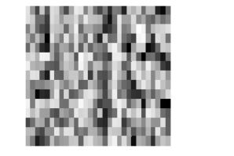

The function 'plot_filters_single_channel' also takes the weight tensor and displays each of the filter data. It dislays each channel of the filter separately. For 3 channels(RGB) it displays each one separately.

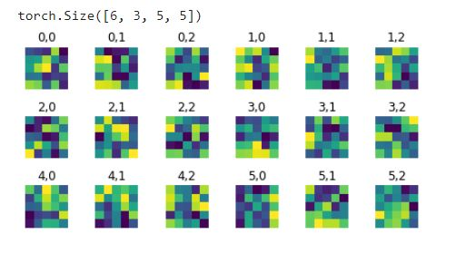

The function 'plot_filters_multi_channel' also takes the weight tensor and displays the filter data. It can only display when the number of channels are 3. It displays them in colored image.

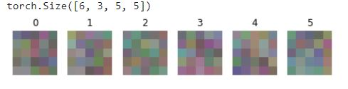

